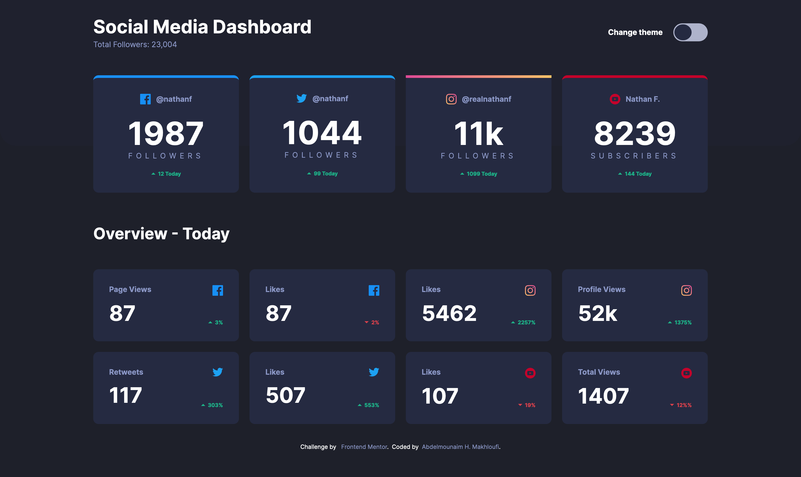
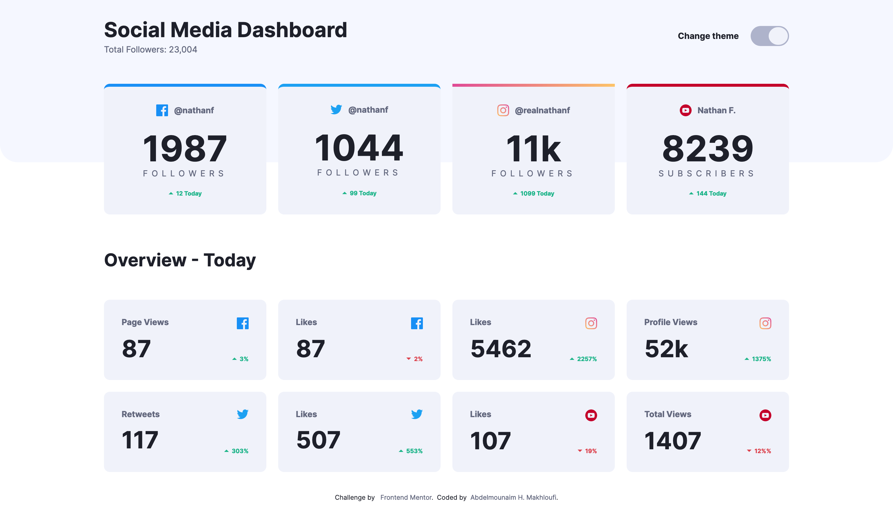
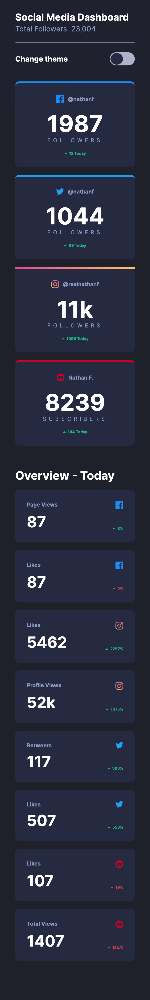

# Frontend Mentor - Loopstudios landing page solution

This is a solution to the [Loopstudios landing page challenge on Frontend Mentor](https://www.frontendmentor.io/challenges/loopstudios-landing-page-N88J5Onjw).

## Table of contents

- [Overview](#overview)
  - [Screenshot](#screenshot)
  - [Links](#links)
- [My process](#my-process)
  - [Built with](#built-with)
  - [What I learned](#what-i-learned)
  - [Continued development](#continued-development)
  - [Useful resources](#useful-resources)
- [Author](#author)

## Overview

### Screenshot





### Links

- Solution URL: [Solution URL](https://github.com/HassanMak29/)
- Live Site URL: [Live site URL](https://frontend-mentor-.netlify.app/)

## My process

### Built with

- Semantic HTML5 markup
- CSS custom properties
- Flexbox
- CSS Grid
- Desktop-first workflow
- [Vite](https://vite.dev/) - JS tool
- [PostCSS](https://postcss.org/) - For styles

### What I learned

```css
header {
  height: clamp(70vh, 67vw, 65rem);
}
```

## Author

- Website - [Abdelmounaim H. Makhloufi](https://www.makhloufi.me)
- Frontend Mentor - [@HassanMak29](https://www.frontendmentor.io/profile/HassanMak29)
